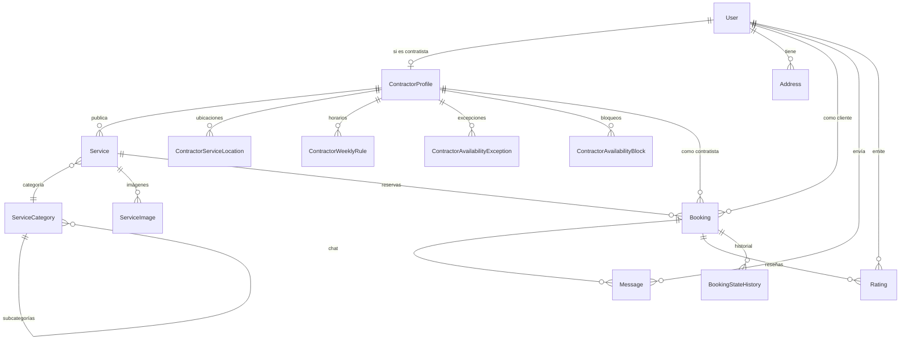

# **Software Development Design (SDD)**

**Proyecto:** ReparaYa — MVP Web (Zona Metropolitana de Guadalajara)

**Versión:** v2.0
**Fecha:** 25/11/2025
**Propietario del SDD:** Mateo Garcia Lopez
**Sponsor:** David Emmanuel Ramírez
**Clasificación:** Uso interno y Sponsor

## **0\. Control de cambios**

| Versión | Fecha | Autor | Descripción |
| ----- | ----- | ----- | ----- |
| 1.0 | 11/09/2025 | Equipo | Versión inicial |
| 2.0 | 25/11/2025 | Mateo Garcia Lopez | Actualización completa: modelo de datos actualizado a Prisma schema, adición de secciones 3-6 según IEEE 1016 |

---

# **1\. Introducción**

### **1.1 Propósito**

El propósito de este documento es definir el diseño y arquitectura del sistema **ReparaYa**. Se detallarán las funciones y arquitectura del proyecto así como la forma en la que se conectan los distintos servicios, sus interfaces de comunicación y las dependencias externas. Este diseño proporciona la guía técnica para el desarrollo, integración y mantenimiento del sistema, garantizando el cumplimiento de los requerimientos desarrollados en el documento **SRS** (Software Requirements Specification).

### **1.2 Alcance**

**ReparaYa** está orientada a ofrecer una **solución digital integral** que facilite la **búsqueda, reserva, calificación y pago de contratistas** dedicados a diversos servicios locales (por ejemplo, mantenimiento, reparaciones o instalaciones).

El sistema permitirá a los usuarios **explorar y seleccionar servicios** dentro de una amplia variedad de categorías, así como **registrarse para ofrecer sus propios servicios** dentro de la misma plataforma, promoviendo un **ecosistema colaborativo** entre clientes y prestadores.

Asimismo, la plataforma integrará un **sistema de calificación y reseñas** que permitirá a los usuarios **evaluar la calidad del servicio recibido**, generando una retroalimentación constante que contribuya a la mejora continua de los contratistas y fomente la confianza y transparencia dentro del sistema.

Durante su fase inicial, el alcance del proyecto se limitará a la **zona metropolitana de Guadalajara**, priorizando la **escalabilidad, estabilidad y modularidad** de la arquitectura. A futuro, se proyecta una expansión progresiva hacia otras regiones de México, manteniendo los mismos estándares de calidad, seguridad y rendimiento.

Finalmente, la propuesta actual contempla únicamente el **canal web responsive** como medio principal de interacción. Las **aplicaciones móviles nativas** quedan fuera del alcance del presente **MVP (Minimum Viable Product)**.

### **1.3 Definiciones, acrónimos y abreviaciones**

Este apartado contiene las definiciones de todos los términos, acrónimos y abreviaturas utilizados en este documento.

| Término / Acrónimo | Definición |
| ----- | ----- |
| API | *Application Programming Interface* — Conjunto de métodos y endpoints que permiten la comunicación entre componentes del sistema. |
| AWS | *Amazon Web Services* — Proveedor de servicios en la nube utilizado para geocodificación (Amazon Location Service), almacenamiento (S3) y correo transaccional (SES). |
| Clerk | Servicio de autenticación como servicio (Auth-as-a-Service) utilizado para gestión de identidad, sesiones y webhooks de usuarios. |
| DB | *Database* — Base de datos relacional PostgreSQL empleada para el almacenamiento persistente de información. |
| DTO | *Data Transfer Object* — Objeto que define la estructura de datos para transferencia entre capas. |
| MVP | *Minimum Viable Product* — Versión mínima funcional del sistema, centrada en validar las funcionalidades principales. |
| ORM | *Object-Relational Mapping* — Técnica de programación que convierte datos entre sistemas de tipos incompatibles. |
| Prisma | ORM de tipo seguro para Node.js y TypeScript utilizado para el acceso a la base de datos. |
| REST | *Representational State Transfer* — Estilo arquitectónico para la comunicación entre cliente y servidor mediante HTTP. |
| S3 | *Simple Storage Service* — Servicio de almacenamiento de objetos utilizado para guardar archivos multimedia. |
| SDD | *Software Design Description* — Documento que describe el diseño técnico, la arquitectura y las interacciones del sistema. |
| SRS | *Software Requirements Specification* — Documento que define los requerimientos funcionales y no funcionales del sistema. |
| Stripe Connect | Pasarela de pago utilizada para procesar anticipos, liquidaciones y comisiones con modelo Express para contratistas. |
| Webhook | Callback HTTP que permite a servicios externos notificar eventos al sistema en tiempo real. |
| Zod | Librería de validación de esquemas TypeScript-first utilizada para validación de entrada. |

### **1.4 Referencias**

1. **SRS — ReparaYa v1.0 (2025)** — Especificación de Requerimientos de Software asociada a este SDD.
2. **IEEE 1016-2009** — Standard for Information Technology—Systems Design—Software Design Descriptions.
3. **W3C Web Content Accessibility Guidelines (WCAG) 2.1 AA** — Accessibility standard for web interfaces.
4. **Stripe API v2024-08** — Stripe Checkout and Connect Express documentation.
5. **Clerk Documentation** — Authentication and user management service documentation.
6. **Amazon Location Service Developer Guide** — Geocoding and map services documentation.
7. **Amazon Simple Email Service (SES)** — Transactional email delivery and configuration guide.
8. **Next.js 14 Documentation** — Framework documentation for App Router and Server Components.
9. **Prisma Documentation** — ORM documentation for schema design and migrations.

### **1.5 Descripción general del documento**

Este documento está estructurado conforme a la norma **IEEE 1016**, con el propósito de ofrecer una descripción técnica clara, modular y trazable del sistema **ReparaYa — MVP Web**.

Las secciones que lo componen son las siguientes:

* **Sección 1 – Introducción:** Presenta el propósito, alcance, definiciones, referencias y visión general del documento.

* **Sección 2 – Descripción general del diseño:** Describe la arquitectura global del sistema, los patrones de diseño aplicados, las capas principales y los componentes de software.

* **Sección 3 – Diseño detallado:** Define la estructura de datos, diagramas de clases, modelos de entidad-relación, y flujos lógicos de procesos clave (autenticación, reserva, pago, mensajería, etc.).

* **Sección 4 – Interfaces externas:** Detalla las interacciones con sistemas de terceros, incluyendo Clerk, Stripe, AWS S3, SES y Location Service.

* **Sección 5 – Requisitos de rendimiento y seguridad:** Expone los lineamientos de calidad, escalabilidad, encriptación, autenticación y control de errores.

* **Sección 6 – Trazabilidad y futuras extensiones:** Establece la relación entre los componentes de diseño y los requisitos del SRS, así como las proyecciones de evolución del sistema.

---

# **2\. Diseño**

### **2.1 Perspectiva del sistema**

El sistema **ReparaYa** es una plataforma web tipo *marketplace* que conecta a **clientes** que requieren servicios locales con **contratistas** que los ofrecen (por ejemplo, mantenimiento, plomería, electricidad o reparaciones domésticas).

La aplicación se implementa bajo una **arquitectura cliente–servidor de tres capas**, asegurando separación de responsabilidades, escalabilidad y mantenibilidad.

**Capas principales del sistema:**

1. **Capa de presentación (Frontend):**
   Implementada en **Next.js 14** con **React Server Components** y **TailwindCSS**, responsable de la interfaz web responsive. Maneja la interacción con el usuario final, validación de formularios y consumo de API REST/Server Actions.

2. **Capa de negocio (Backend):**
   Desarrollada como módulos TypeScript dentro de Next.js App Router, donde reside la lógica de negocio. Gestiona autenticación (Clerk), reservas, pagos, calificaciones, mensajería y operaciones administrativas. Utiliza el patrón Service-Repository.

3. **Capa de datos (Persistencia):**
   Basada en **PostgreSQL (Supabase)** y gestionada mediante **Prisma ORM**, responsable del almacenamiento persistente y la integridad de la información.

**Servicios externos integrados:**

* **Clerk:** Autenticación, gestión de sesiones, sincronización de usuarios vía webhooks.

* **Stripe (Checkout + Connect Express):** Procesa anticipos, liquidaciones y comisiones; recibe y maneja webhooks de pago.

* **Amazon S3:** Almacenamiento de imágenes de servicios con upload directo vía presigned URLs.

* **Amazon Location Service:** Permite geocodificación y cálculo de distancias mediante la fórmula de Haversine.

* **AWS SES / SMTP:** Envía correos electrónicos transaccionales y notificaciones al usuario.

El sistema está diseñado para operar en la **nube (Vercel + Supabase)**, utilizando prácticas de *DevOps* para despliegue continuo y monitoreo.

### **2.2 Objetivos del diseño**

El diseño del sistema ReparaYa persigue los siguientes objetivos técnicos:

* **Escalabilidad:** El sistema debe soportar crecimiento progresivo en número de usuarios, servicios y transacciones sin comprometer el rendimiento.

* **Mantenibilidad:** Facilitar la comprensión y modificación del código a través de una estructura modular y desacoplada.

* **Seguridad:** Implementación de autenticación delegada a Clerk, autorización por roles (RBAC), validación de entrada con Zod, uso de HTTPS y conformidad con la LFPDPPP para protección de datos personales.

* **Disponibilidad:** El sistema deberá mantener una operación continua y estable, con manejo de errores controlado en la capa backend.

* **Extensibilidad:** Facilitar la incorporación futura de módulos como apps móviles, programas de fidelización y pagos internacionales.

* **Type Safety:** Uso de TypeScript strict mode en todo el codebase para prevenir errores en tiempo de compilación.

### **2.3 Patrones arquitectónicos**

En el siguiente apartado se mostrarán los patrones de diseño utilizados en el sistema.

| Tipo | Patrón | Descripción | Justificación |
| :---: | :---: | :---: | :---: |
| Arquitectónico | N-Capas | Divide la aplicación en presentación, negocio y datos. | Aumenta la mantenibilidad y escalabilidad. |
| Arquitectónico | Modular Monolith | Organiza el código en módulos de dominio cohesivos (`src/modules/*`). | Facilita evolución hacia microservicios si es necesario. |
| Diseño | Service-Repository | Separa lógica de negocio (services) de acceso a datos (repositories). | Facilita testing y sustitución del ORM. |
| Diseño | State Machine | Gestiona transiciones de estado de reservas y servicios. | Garantiza integridad de estados y transiciones válidas. |
| Diseño | DTO + Zod Validation | Define estructuras para enviar/recibir datos por la API con validación runtime. | Garantiza consistencia y seguridad de entrada. |
| Comportamiento | Event-Driven (Webhooks) | Procesa eventos externos de Clerk y Stripe de forma asíncrona. | Desacopla integraciones y mejora resiliencia. |
| Seguridad | RBAC (Role-Based Access Control) | Control de acceso basado en roles (CLIENT, CONTRACTOR, ADMIN). | Simplifica autorización y auditoría. |

### **2.4 Componentes principales del sistema**

El sistema se compone de los siguientes módulos funcionales organizados en `src/modules/`:

| Módulo | Descripción |
| :---: | :---: |
| **auth** | Integración con Clerk: helpers `getCurrentUser()`, `requireAuth()`, `requireRole()`. Webhook handler para sincronización de usuarios. |
| **users** | Gestiona perfiles de usuario, estado de cuenta y datos básicos sincronizados desde Clerk. |
| **contractors** | Administra perfiles de contratistas, verificación, ubicación y disponibilidad. |
| **services** | CRUD de servicios, categorías, imágenes (S3), y máquina de estados de visibilidad (DRAFT→ACTIVE↔PAUSED→ARCHIVED). |
| **booking** | Creación, actualización y cancelación de reservas con máquina de estados completa. Incluye historial de transiciones. |
| **payments** | Integra la API de Stripe para gestionar anticipos y liquidaciones, incluyendo manejo idempotente de webhooks. |
| **messaging** | Gestiona la mensajería entre cliente y contratista dentro del contexto de una reserva. |
| **ratings** | Administra reseñas, calificaciones y estadísticas agregadas de contratistas. |
| **admin** | Permite revisar reportes, disputas y moderar usuarios, servicios y categorías. |

### **2.5 Diagrama general del sistema**

El modelo de clases del sistema **ReparaYa** representa las entidades del dominio que intervienen en los procesos de publicación de servicios, reservas, pagos, reseñas y comunicación. El diseño sigue los principios de orientación a objetos y garantiza consistencia con el modelo relacional de la base de datos.

**Relaciones principales:**

* **User** es la entidad central con `clerkUserId` para autenticación externa.
* **User** puede tener un **ContractorProfile** (relación 1:1 opcional).
* **ContractorProfile** tiene múltiples **Services** (1:N).
* **ContractorProfile** tiene múltiples reglas de disponibilidad (WeeklyRule, Exception, Block).
* **User (Cliente)** genera múltiples **Bookings** (1:N).
* **Booking** integra relaciones con **Service**, **Messages**, **Ratings** y tiene historial de estados.
* **Service** tiene múltiples **ServiceImages** y está asociado a una **ServiceCategory**.

| Clase | Descripción | Métodos principales |
| :---: | :---: | :---: |
| User | Entidad central con datos de autenticación y perfil básico. | `getCurrentUser()`, `requireAuth()`, `requireRole()` |
| ContractorProfile | Extiende User con datos específicos de contratista (negocio, verificación). | `getProfile()`, `updateProfile()`, `verifyContractor()` |
| Service | Representa los servicios publicados en la plataforma. | `create()`, `update()`, `publish()`, `pause()`, `archive()` |
| ServiceCategory | Categorización jerárquica de servicios (categoría principal + subcategorías). | `list()`, `getBySlug()` |
| Booking | Controla el flujo de contratación entre cliente y contratista. | `create()`, `advanceState()`, `cancel()`, `getHistory()` |
| Payment | Gestiona los pagos asociados a las reservas (anticipo + liquidación). | `createCheckoutSession()`, `processWebhook()` |
| Message | Canal de comunicación entre cliente y contratista. | `send()`, `listByBooking()`, `markAsRead()` |
| Rating | Permite calificar y dejar comentarios sobre los servicios. | `create()`, `getStats()` |

### **2.6 Interfaces externas**

**Clerk (Autenticación):**
- Autenticación de usuarios vía email/password
- Gestión de sesiones con cookies httpOnly/secure
- Webhooks: `user.created`, `user.updated`, `user.deleted`
- Verificación de firma con `svix`
- Sincronización automática con tabla `users`

**Stripe (Checkout + Connect Express):**
- Sesiones separadas para anticipo (20%) y liquidación (80%) en MXN
- Onboarding de contratistas con Express accounts
- Comisión desde el markup 15%
- Transferencia al contratista ≤24h tras liquidación
- Webhooks: `checkout.session.completed`, `payment_intent.succeeded`, `charge.refunded`, `transfer.created`, `payout.paid`, `charge.dispute.created`
- Idempotencia via `ProcessedWebhookEvent`

**Amazon S3:**
- Bucket `reparaya-media-dev` para imágenes de servicios
- Upload directo via presigned URLs (1h expiry)
- Key pattern: `contractor-services/{contractorId}/{serviceId}/{uuid}.{ext}`
- MIME types permitidos: `image/jpeg`, `image/png`, `image/webp`
- Máximo 5 imágenes por servicio, 10MB por imagen

**Amazon Location Service:**
- Place Index para geocodificación de direcciones
- Cálculo de distancia Haversine para cobertura de servicio

**AWS SES / SMTP:**
- Correos transaccionales (confirmaciones, notificaciones)
- Remitente verificado
- Fallas registradas para monitorización

---

### **2.7 Modelo de datos (MVP)**

> **Nota:** Este modelo refleja el esquema actual de Prisma implementado en producción. Se utiliza Clerk para autenticación externa (no se almacenan contraseñas).

#### **2.7.1 Diagrama ER — Representación mermaid**



#### **2.7.2 Matriz de relaciones (cardinalidades + FK)**

| Origen | Relación | Destino | Card. | FK |
| :---: | :---: | :---: | :---: | :---: |
| User | puede ser | ContractorProfile | 1→0..1 | ContractorProfile.userId → User.id |
| User | tiene | Address | 1→* | Address.userId → User.id |
| User (Cliente) | crea | Booking | 1→* | Booking.clientId → User.id |
| ContractorProfile | publica | Service | 1→* | Service.contractorId → ContractorProfile.id |
| ContractorProfile | tiene ubicación | ContractorServiceLocation | 1→* | ContractorServiceLocation.contractorProfileId |
| ContractorProfile | tiene horarios | ContractorWeeklyRule | 1→* | ContractorWeeklyRule.contractorProfileId |
| ContractorProfile | tiene excepciones | ContractorAvailabilityException | 1→* | ContractorAvailabilityException.contractorProfileId |
| ContractorProfile | tiene bloqueos | ContractorAvailabilityBlock | 1→* | ContractorAvailabilityBlock.contractorProfileId |
| ContractorProfile | atiende | Booking | 1→* | Booking.contractorId → ContractorProfile.id |
| Service | es de | ServiceCategory | *→1 | Service.categoryId → ServiceCategory.id |
| Service | tiene | ServiceImage | 1→* | ServiceImage.serviceId → Service.id |
| ServiceCategory | padre de | ServiceCategory | 1→* | ServiceCategory.parentId → ServiceCategory.id |
| Booking | sobre | Service | *→1 | Booking.serviceId → Service.id |
| Booking | tiene chat | Message | 1→* | Message.bookingId → Booking.id |
| Booking | recibe | Rating | 1→* | Rating.bookingId → Booking.id |
| Booking | tiene historial | BookingStateHistory | 1→* | BookingStateHistory.bookingId → Booking.id |
| User | envía | Message | 1→* | Message.senderId → User.id |
| User | reseña | Rating | 1→* | Rating.reviewerId → User.id |

#### **2.7.3 Entidades, Enums e Índices**

##### **Enumeraciones (Enums)**

```prisma
enum UserRole {
  CLIENT
  CONTRACTOR
  ADMIN
}

enum UserStatus {
  ACTIVE
  BLOCKED
  PENDING_VERIFICATION
}

enum BookingStatus {
  PENDING_APPROVAL      // Esperando aprobación del contratista
  PENDING_PAYMENT       // Aprobado, esperando pago de anticipo
  CONFIRMED             // Anticipo pagado, reserva confirmada
  ON_ROUTE              // Contratista en camino
  ON_SITE               // Contratista en sitio
  IN_PROGRESS           // Trabajo en progreso
  COMPLETED             // Trabajo completado
  CANCELLED             // Reserva cancelada
  DISPUTED              // En disputa
}

enum ServiceVisibilityStatus {
  DRAFT                 // En construcción, no público
  ACTIVE                // Publicado y visible
  PAUSED                // Temporalmente oculto
  ARCHIVED              // Eliminado (soft delete)
}

enum PaymentType {
  ANTICIPO              // 20% del total
  LIQUIDACION           // 80% restante
  REFUND                // Reembolso
}

enum PaymentStatus {
  INITIATED
  SUCCEEDED
  FAILED
}

enum ExceptionType {
  AVAILABLE             // Agrega disponibilidad
  BLOCKED               // Bloquea el día
}
```

##### **Tabla `User`**

| Campo | Tipo | Constraints | Descripción |
| ----- | ----- | ----- | ----- |
| id | `uuid` | PK, DEFAULT uuid_generate_v4() | Identificador único |
| clerkUserId | `varchar(255)` | UNIQUE NOT NULL | ID externo de Clerk |
| email | `varchar(255)` | UNIQUE NOT NULL | Email del usuario |
| firstName | `varchar(100)` | NULL | Nombre |
| lastName | `varchar(100)` | NULL | Apellido |
| phone | `varchar(20)` | NULL | Teléfono |
| role | `UserRole` | NOT NULL DEFAULT 'CLIENT' | Rol del usuario |
| status | `UserStatus` | NOT NULL DEFAULT 'ACTIVE' | Estado de la cuenta |
| createdAt | `timestamptz` | NOT NULL DEFAULT now() | Fecha de creación |
| updatedAt | `timestamptz` | NOT NULL | Última actualización |

**Índices:** `idx_user_clerk_id (clerkUserId)`, `idx_user_email (email)`, `idx_user_role (role)`

##### **Tabla `ContractorProfile`**

| Campo | Tipo | Constraints | Descripción |
| ----- | ----- | ----- | ----- |
| id | `uuid` | PK | Identificador único |
| userId | `uuid` | FK→User.id UNIQUE NOT NULL | Usuario asociado |
| businessName | `varchar(200)` | NULL | Nombre comercial |
| description | `text` | NULL | Descripción del negocio |
| verified | `boolean` | DEFAULT false | Estado de verificación |
| verifiedAt | `timestamptz` | NULL | Fecha de verificación |
| stripeAccountId | `varchar(255)` | NULL | ID de cuenta Stripe Connect |
| stripeAccountStatus | `varchar(50)` | NULL | Estado de onboarding Stripe |
| createdAt | `timestamptz` | NOT NULL DEFAULT now() | Fecha de creación |
| updatedAt | `timestamptz` | NOT NULL | Última actualización |

**Índices:** `idx_contractor_user (userId)`, `idx_contractor_verified (verified)`, `idx_contractor_stripe (stripeAccountId)`

##### **Tabla `ContractorServiceLocation`**

| Campo | Tipo | Constraints | Descripción |
| ----- | ----- | ----- | ----- |
| id | `uuid` | PK | Identificador único |
| contractorProfileId | `uuid` | FK→ContractorProfile.id NOT NULL | Contratista |
| addressLine | `varchar(500)` | NOT NULL | Dirección completa |
| city | `varchar(100)` | NOT NULL | Ciudad |
| state | `varchar(100)` | NOT NULL | Estado |
| postalCode | `varchar(20)` | NOT NULL | Código postal |
| country | `varchar(100)` | DEFAULT 'México' | País |
| latitude | `decimal(10,7)` | NULL | Latitud |
| longitude | `decimal(10,7)` | NULL | Longitud |
| timezone | `varchar(50)` | DEFAULT 'America/Mexico_City' | Zona horaria IANA |
| radiusKm | `decimal(5,2)` | DEFAULT 25.00 | Radio de cobertura |
| isPrimary | `boolean` | DEFAULT false | Es ubicación principal |
| createdAt | `timestamptz` | NOT NULL DEFAULT now() | Fecha de creación |
| updatedAt | `timestamptz` | NOT NULL | Última actualización |

**Índices:** `idx_location_contractor (contractorProfileId)`, `idx_location_coords (latitude, longitude)`

##### **Tabla `ContractorWeeklyRule`**

| Campo | Tipo | Constraints | Descripción |
| ----- | ----- | ----- | ----- |
| id | `uuid` | PK | Identificador único |
| contractorProfileId | `uuid` | FK→ContractorProfile.id NOT NULL | Contratista |
| dayOfWeek | `smallint` | NOT NULL CHECK (0-6) | Día de la semana (0=Dom) |
| intervals | `jsonb` | NOT NULL | Array de {startTime, endTime} |
| enabled | `boolean` | DEFAULT true | Regla activa |
| createdAt | `timestamptz` | NOT NULL DEFAULT now() | Fecha de creación |
| updatedAt | `timestamptz` | NOT NULL | Última actualización |

**Índices:** `idx_weekly_contractor_day (contractorProfileId, dayOfWeek)`

##### **Tabla `ContractorAvailabilityException`**

| Campo | Tipo | Constraints | Descripción |
| ----- | ----- | ----- | ----- |
| id | `uuid` | PK | Identificador único |
| contractorProfileId | `uuid` | FK→ContractorProfile.id NOT NULL | Contratista |
| date | `date` | NOT NULL | Fecha de la excepción |
| intervals | `jsonb` | NOT NULL | Array de {startTime, endTime} |
| type | `ExceptionType` | NOT NULL | AVAILABLE o BLOCKED |
| reason | `varchar(255)` | NULL | Razón de la excepción |
| createdAt | `timestamptz` | NOT NULL DEFAULT now() | Fecha de creación |
| updatedAt | `timestamptz` | NOT NULL | Última actualización |

**Constraints:** `UNIQUE (contractorProfileId, date)`
**Índices:** `idx_exception_contractor_date (contractorProfileId, date)`

##### **Tabla `ContractorAvailabilityBlock`**

| Campo | Tipo | Constraints | Descripción |
| ----- | ----- | ----- | ----- |
| id | `uuid` | PK | Identificador único |
| contractorProfileId | `uuid` | FK→ContractorProfile.id NOT NULL | Contratista |
| startDateTime | `timestamptz` | NOT NULL | Inicio del bloqueo |
| endDateTime | `timestamptz` | NOT NULL | Fin del bloqueo |
| reason | `varchar(255)` | NULL | Razón del bloqueo |
| createdAt | `timestamptz` | NOT NULL DEFAULT now() | Fecha de creación |
| updatedAt | `timestamptz` | NOT NULL | Última actualización |

**Índices:** `idx_block_contractor_range (contractorProfileId, startDateTime, endDateTime)`

##### **Tabla `Address`**

| Campo | Tipo | Constraints | Descripción |
| ----- | ----- | ----- | ----- |
| id | `uuid` | PK | Identificador único |
| userId | `uuid` | FK→User.id NOT NULL | Usuario propietario |
| street | `varchar(200)` | NOT NULL | Calle |
| extNumber | `varchar(20)` | NOT NULL | Número exterior |
| intNumber | `varchar(20)` | NULL | Número interior |
| neighborhood | `varchar(100)` | NULL | Colonia |
| city | `varchar(100)` | NOT NULL | Ciudad |
| state | `varchar(100)` | NOT NULL | Estado |
| postalCode | `varchar(10)` | NOT NULL | Código postal |
| latitude | `decimal(10,7)` | NULL | Latitud |
| longitude | `decimal(10,7)` | NULL | Longitud |
| isDefault | `boolean` | DEFAULT false | Es dirección principal |
| createdAt | `timestamptz` | NOT NULL DEFAULT now() | Fecha de creación |
| updatedAt | `timestamptz` | NOT NULL | Última actualización |

**Índices:** `idx_address_user (userId)`

##### **Tabla `ServiceCategory`**

| Campo | Tipo | Constraints | Descripción |
| ----- | ----- | ----- | ----- |
| id | `uuid` | PK | Identificador único |
| parentId | `uuid` | FK→ServiceCategory.id NULL | Categoría padre |
| name | `varchar(100)` | NOT NULL | Nombre de la categoría |
| slug | `varchar(100)` | UNIQUE NOT NULL | Slug URL-friendly |
| description | `varchar(500)` | NULL | Descripción |
| icon | `varchar(50)` | NULL | Nombre del ícono |
| sortOrder | `smallint` | DEFAULT 0 | Orden de visualización |
| isActive | `boolean` | DEFAULT true | Categoría activa |
| createdAt | `timestamptz` | NOT NULL DEFAULT now() | Fecha de creación |
| updatedAt | `timestamptz` | NOT NULL | Última actualización |

**Índices:** `idx_category_slug (slug)`, `idx_category_parent_order (parentId, sortOrder)`

##### **Tabla `Service`**

| Campo | Tipo | Constraints | Descripción |
| ----- | ----- | ----- | ----- |
| id | `uuid` | PK | Identificador único |
| contractorId | `uuid` | FK→ContractorProfile.id NOT NULL | Contratista propietario |
| categoryId | `uuid` | FK→ServiceCategory.id NOT NULL | Categoría del servicio |
| title | `varchar(100)` | NOT NULL | Título del servicio |
| description | `varchar(2000)` | NOT NULL | Descripción detallada |
| basePrice | `decimal(10,2)` | NOT NULL CHECK (≥50, ≤50000) | Precio base en MXN |
| currency | `char(3)` | DEFAULT 'MXN' | Moneda |
| durationMinutes | `smallint` | NOT NULL CHECK (30-480) | Duración estimada |
| visibilityStatus | `ServiceVisibilityStatus` | DEFAULT 'DRAFT' | Estado de publicación |
| lastPublishedAt | `timestamptz` | NULL | Última publicación |
| createdAt | `timestamptz` | NOT NULL DEFAULT now() | Fecha de creación |
| updatedAt | `timestamptz` | NOT NULL | Última actualización |

**Índices:** `idx_service_contractor_status (contractorId, visibilityStatus)`, `idx_service_category_status (categoryId, visibilityStatus)`, `idx_service_price (basePrice, visibilityStatus)`

##### **Tabla `ServiceImage`**

| Campo | Tipo | Constraints | Descripción |
| ----- | ----- | ----- | ----- |
| id | `uuid` | PK | Identificador único |
| serviceId | `uuid` | FK→Service.id NOT NULL (CASCADE) | Servicio asociado |
| s3Url | `varchar(500)` | NOT NULL | URL completa de S3 |
| s3Key | `varchar(500)` | NOT NULL | Key de S3 |
| order | `smallint` | NOT NULL | Orden de visualización (0-4) |
| width | `smallint` | NULL | Ancho en píxeles |
| height | `smallint` | NULL | Alto en píxeles |
| altText | `varchar(200)` | NULL | Texto alternativo |
| uploadedAt | `timestamptz` | DEFAULT now() | Fecha de upload |

**Índices:** `idx_image_service_order (serviceId, order)`

##### **Tabla `Booking`**

| Campo | Tipo | Constraints | Descripción |
| ----- | ----- | ----- | ----- |
| id | `uuid` | PK | Identificador único |
| clientId | `uuid` | FK→User.id NOT NULL | Cliente |
| contractorId | `uuid` | FK→ContractorProfile.id NOT NULL | Contratista |
| serviceId | `uuid` | FK→Service.id NOT NULL | Servicio reservado |
| status | `BookingStatus` | NOT NULL DEFAULT 'PENDING_APPROVAL' | Estado actual |
| scheduledDate | `timestamptz` | NOT NULL | Fecha programada |
| address | `varchar(500)` | NOT NULL | Dirección del servicio |
| notes | `varchar(1000)` | NULL | Notas adicionales |
| basePrice | `decimal(10,2)` | NOT NULL | Precio base |
| finalPrice | `decimal(10,2)` | NOT NULL | Precio final |
| anticipoAmount | `decimal(10,2)` | NOT NULL | Monto de anticipo (20%) |
| liquidacionAmount | `decimal(10,2)` | NOT NULL | Monto de liquidación (80%) |
| currency | `char(3)` | DEFAULT 'MXN' | Moneda |
| stripeCheckoutSessionId | `varchar(255)` | NULL | ID de sesión Stripe |
| stripePaymentIntentId | `varchar(255)` | NULL | ID de payment intent |
| createdAt | `timestamptz` | NOT NULL DEFAULT now() | Fecha de creación |
| updatedAt | `timestamptz` | NOT NULL | Última actualización |

**Índices:** `idx_booking_client (clientId, scheduledDate)`, `idx_booking_contractor (contractorId, scheduledDate)`, `idx_booking_status (status)`

##### **Tabla `BookingStateHistory`**

| Campo | Tipo | Constraints | Descripción |
| ----- | ----- | ----- | ----- |
| id | `uuid` | PK | Identificador único |
| bookingId | `uuid` | FK→Booking.id NOT NULL (CASCADE) | Reserva |
| fromState | `BookingStatus` | NOT NULL | Estado anterior |
| toState | `BookingStatus` | NOT NULL | Estado nuevo |
| changedBy | `uuid` | FK→User.id NOT NULL | Usuario que cambió |
| notes | `varchar(500)` | NULL | Notas del cambio |
| createdAt | `timestamptz` | NOT NULL DEFAULT now() | Fecha del cambio |

**Índices:** `idx_history_booking (bookingId, createdAt)`

##### **Tabla `Payment`**

| Campo | Tipo | Constraints | Descripción |
| ----- | ----- | ----- | ----- |
| id | `uuid` | PK | Identificador único |
| bookingId | `uuid` | FK→Booking.id NOT NULL | Reserva asociada |
| type | `PaymentType` | NOT NULL | Tipo de pago |
| status | `PaymentStatus` | NOT NULL DEFAULT 'INITIATED' | Estado del pago |
| amount | `decimal(10,2)` | NOT NULL | Monto |
| currency | `char(3)` | DEFAULT 'MXN' | Moneda |
| stripeCheckoutSessionId | `varchar(255)` | NULL | ID sesión Stripe |
| stripePaymentIntentId | `varchar(255)` | NULL | ID payment intent |
| stripeChargeId | `varchar(255)` | NULL | ID del cargo |
| stripeTransferId | `varchar(255)` | NULL | ID de transferencia |
| createdAt | `timestamptz` | NOT NULL DEFAULT now() | Fecha de creación |
| updatedAt | `timestamptz` | NOT NULL | Última actualización |

**Índices:** `idx_payment_booking (bookingId)`, `idx_payment_stripe_session (stripeCheckoutSessionId)`, `idx_payment_type_status (type, status)`

##### **Tabla `ProcessedWebhookEvent`**

| Campo | Tipo | Constraints | Descripción |
| ----- | ----- | ----- | ----- |
| id | `uuid` | PK | Identificador único |
| eventId | `varchar(255)` | UNIQUE NOT NULL | ID del evento Stripe |
| eventType | `varchar(100)` | NOT NULL | Tipo de evento |
| processedAt | `timestamptz` | NOT NULL DEFAULT now() | Fecha de procesamiento |

**Propósito:** Garantizar idempotencia en procesamiento de webhooks de Stripe.

##### **Tabla `Message`**

| Campo | Tipo | Constraints | Descripción |
| ----- | ----- | ----- | ----- |
| id | `uuid` | PK | Identificador único |
| bookingId | `uuid` | FK→Booking.id NOT NULL | Reserva del chat |
| senderId | `uuid` | FK→User.id NOT NULL | Usuario remitente |
| content | `text` | NOT NULL | Contenido del mensaje |
| readAt | `timestamptz` | NULL | Fecha de lectura |
| createdAt | `timestamptz` | NOT NULL DEFAULT now() | Fecha de envío |

**Retención:** Eliminación automática de registros > 7 días tras completar reserva.
**Índices:** `idx_message_booking (bookingId, createdAt)`

##### **Tabla `Rating`**

| Campo | Tipo | Constraints | Descripción |
| ----- | ----- | ----- | ----- |
| id | `uuid` | PK | Identificador único |
| bookingId | `uuid` | FK→Booking.id NOT NULL | Reserva calificada |
| reviewerId | `uuid` | FK→User.id NOT NULL | Usuario que califica |
| revieweeId | `uuid` | FK→User.id NOT NULL | Usuario calificado |
| stars | `smallint` | NOT NULL CHECK (1-5) | Calificación |
| comment | `varchar(500)` | NULL | Comentario |
| isVisible | `boolean` | DEFAULT true | Visible públicamente |
| removedReason | `varchar(280)` | NULL | Razón de eliminación |
| createdAt | `timestamptz` | NOT NULL DEFAULT now() | Fecha de creación |

**Constraints:** `UNIQUE (bookingId, reviewerId)`
**Índices:** `idx_rating_reviewee (revieweeId, createdAt)`, `idx_rating_booking (bookingId)`

##### **Tabla `ServiceRatingStats`**

| Campo | Tipo | Constraints | Descripción |
| ----- | ----- | ----- | ----- |
| id | `uuid` | PK | Identificador único |
| serviceId | `uuid` | FK→Service.id UNIQUE NOT NULL | Servicio |
| averageRating | `decimal(3,2)` | NOT NULL DEFAULT 0 | Promedio de calificación |
| totalRatings | `int` | NOT NULL DEFAULT 0 | Total de calificaciones |
| updatedAt | `timestamptz` | NOT NULL | Última actualización |

**Propósito:** Estadísticas pre-calculadas para evitar cálculos en tiempo real.

#### **2.7.4 Notas transversales**

* **Autenticación:** Delegada a Clerk. El campo `clerkUserId` vincula usuarios externos con la tabla `User`. No se almacenan contraseñas.

* **Moneda:** `MXN` fija en MVP.

* **Redondeo:** Todos los totales a 2 decimales.

* **Idempotencia de pagos:** Basada en `ProcessedWebhookEvent.eventId` para webhooks de Stripe.

* **Integridad de estados:** Transiciones válidas validadas en aplicación mediante máquinas de estado + constraints de negocio en endpoints.

* **Borrado lógico:** Servicios archivados (`visibilityStatus='ARCHIVED'`), ratings moderados (`isVisible=false`).

* **Zona horaria:** Todas las fechas se almacenan en UTC. Las conversiones a zona horaria del contratista (`timezone`) se hacen en la capa de aplicación.

---

# **3\. Diseño Detallado**

Esta sección describe la arquitectura interna del sistema, incluyendo la estructura de módulos, patrones de diseño implementados, máquinas de estado y flujos de procesos críticos.

### **3.1 Arquitectura de Módulos**

El sistema está organizado en módulos de dominio cohesivos dentro de `src/modules/`. Cada módulo sigue una estructura consistente:

```
src/modules/{módulo}/
├── services/           # Lógica de negocio
├── repositories/       # Acceso a datos (Prisma)
├── types/              # DTOs, interfaces, tipos
├── validators/         # Esquemas Zod
├── errors/             # Errores específicos del módulo
├── utils/              # Utilidades del módulo
└── __tests__/          # Tests unitarios
```

**Diagrama de dependencias entre módulos:**

```
┌─────────────────────────────────────────────────────────────────┐
│                         API Layer                               │
│  (Next.js App Router - /api/* routes, Server Actions)          │
└─────────────────────────────────────────────────────────────────┘
                              │
                              ▼
┌─────────────────────────────────────────────────────────────────┐
│                      Module Layer                                │
│  ┌──────┐ ┌───────┐ ┌────────┐ ┌────────┐ ┌────────┐ ┌───────┐ │
│  │ auth │ │ users │ │contract│ │services│ │booking │ │payments│ │
│  └──────┘ └───────┘ └────────┘ └────────┘ └────────┘ └───────┘ │
│  ┌──────────┐ ┌────────┐ ┌───────┐                              │
│  │ messaging│ │ ratings│ │ admin │                              │
│  └──────────┘ └────────┘ └───────┘                              │
└─────────────────────────────────────────────────────────────────┘
                              │
                              ▼
┌─────────────────────────────────────────────────────────────────┐
│                    Infrastructure Layer                          │
│  ┌────────┐ ┌───────┐ ┌────────┐ ┌─────┐ ┌─────┐               │
│  │ Prisma │ │ Clerk │ │ Stripe │ │ S3  │ │ SES │               │
│  └────────┘ └───────┘ └────────┘ └─────┘ └─────┘               │
└─────────────────────────────────────────────────────────────────┘
```

### **3.2 Patrón Service-Repository**

Cada módulo implementa el patrón Service-Repository para separar la lógica de negocio del acceso a datos.

**Repository:** Encapsula operaciones de base de datos (CRUD) usando Prisma.

```typescript
// Ejemplo: bookingRepository.ts
export const bookingRepository = {
  async findById(id: string): Promise<Booking | null> {
    return prisma.booking.findUnique({
      where: { id },
      include: { service: true, client: true, contractor: true }
    });
  },

  async updateStatus(
    id: string,
    status: BookingStatus,
    changedBy: string
  ): Promise<Booking> {
    return prisma.$transaction(async (tx) => {
      const booking = await tx.booking.findUnique({ where: { id } });

      // Crear historial
      await tx.bookingStateHistory.create({
        data: {
          bookingId: id,
          fromState: booking.status,
          toState: status,
          changedBy
        }
      });

      // Actualizar booking
      return tx.booking.update({
        where: { id },
        data: { status }
      });
    });
  }
};
```

**Service:** Contiene lógica de negocio, validaciones y orquestación.

```typescript
// Ejemplo: bookingService.ts
export const bookingService = {
  async advanceState(
    bookingId: string,
    newStatus: BookingStatus,
    userId: string
  ): Promise<BookingDTO> {
    const booking = await bookingRepository.findById(bookingId);

    // Validar que la transición es válida
    if (!canTransition(booking.status, newStatus)) {
      throw new InvalidStateTransitionError(booking.status, newStatus);
    }

    // Validar permisos
    if (!canUserAdvanceBooking(booking, userId, newStatus)) {
      throw new UnauthorizedBookingAccessError();
    }

    // Ejecutar transición
    const updated = await bookingRepository.updateStatus(
      bookingId,
      newStatus,
      userId
    );

    return mapToDTO(updated);
  }
};
```

### **3.3 Máquinas de Estado**

#### **3.3.1 BookingStatus State Machine**

La máquina de estados de reservas controla el ciclo de vida completo de una reserva.

```
                        [Crear Reserva]
                              │
                              ▼
                    ┌─────────────────────┐
                    │  PENDING_APPROVAL   │◄──────────────────────┐
                    └─────────────────────┘                       │
                              │                                   │
                              │ Contratista aprueba               │
                              ▼                                   │
                    ┌─────────────────────┐                       │
               ┌───►│   PENDING_PAYMENT   │                       │
               │    └─────────────────────┘                       │
               │              │                                   │
               │              │ Cliente paga anticipo             │
               │              ▼                                   │
               │    ┌─────────────────────┐                       │
               │    │     CONFIRMED       │                       │
               │    └─────────────────────┘                       │
               │              │                                   │
               │              │ Contratista en camino             │
               │              ▼                                   │
               │    ┌─────────────────────┐                       │
               │    │      ON_ROUTE       │───────────┐           │
               │    └─────────────────────┘           │           │
               │              │                       │           │
               │              │ Llega al sitio        │           │
               │              ▼                       │           │
               │    ┌─────────────────────┐           │           │
               │    │      ON_SITE        │───────────┤           │
               │    └─────────────────────┘           │           │
               │              │                       │           │
               │              │ Inicia trabajo        │           │
               │              ▼                       │           │
               │    ┌─────────────────────┐           │           │
               │    │    IN_PROGRESS      │───────────┼───────────┤
               │    └─────────────────────┘           │           │
               │              │                       │           │
               │              │ Completa trabajo      │ CANCELLED │
               │              ▼                       │           │
               │    ┌─────────────────────┐           │           │
               │    │     COMPLETED       │───────────┘           │
               │    └─────────────────────┘                       │
               │              │                                   │
               │              │ Disputa abierta                   │
               │              ▼                                   │
               │    ┌─────────────────────┐                       │
               └────│     DISPUTED        │───────────────────────┘
                    └─────────────────────┘
                       (Resuelto → COMPLETED o CANCELLED)
```

**Implementación de transiciones válidas:**

```typescript
export const VALID_TRANSITIONS: Record<BookingStatus, BookingStatus[]> = {
  PENDING_APPROVAL: [BookingStatus.PENDING_PAYMENT, BookingStatus.CANCELLED],
  PENDING_PAYMENT: [BookingStatus.CONFIRMED, BookingStatus.CANCELLED],
  CONFIRMED: [BookingStatus.ON_ROUTE, BookingStatus.CANCELLED],
  ON_ROUTE: [BookingStatus.ON_SITE, BookingStatus.CANCELLED],
  ON_SITE: [BookingStatus.IN_PROGRESS, BookingStatus.CANCELLED],
  IN_PROGRESS: [BookingStatus.COMPLETED, BookingStatus.DISPUTED],
  COMPLETED: [BookingStatus.DISPUTED],
  CANCELLED: [],
  DISPUTED: [BookingStatus.COMPLETED, BookingStatus.CANCELLED],
};
```

**Permisos por transición:**

| Transición | Quién puede ejecutar |
| ----- | ----- |
| PENDING_APPROVAL → PENDING_PAYMENT | Contratista |
| PENDING_APPROVAL → CANCELLED | Cliente o Contratista |
| PENDING_PAYMENT → CONFIRMED | Sistema (webhook de Stripe) |
| PENDING_PAYMENT → CANCELLED | Cliente |
| CONFIRMED → ON_ROUTE | Contratista |
| ON_ROUTE → ON_SITE | Contratista |
| ON_SITE → IN_PROGRESS | Contratista |
| IN_PROGRESS → COMPLETED | Contratista |
| IN_PROGRESS → DISPUTED | Cliente o Contratista |
| COMPLETED → DISPUTED | Cliente |
| DISPUTED → COMPLETED/CANCELLED | Admin |

#### **3.3.2 ServiceVisibilityStatus State Machine**

La máquina de estados de servicios controla la publicación y visibilidad.

```
                        [Crear Servicio]
                              │
                              ▼
                         ┌────────┐
                         │ DRAFT  │◄─────────────┐
                         └────────┘              │
                              │                  │
                              │ publish()        │ unpublish()
                              │ Requisitos:      │
                              │ - verified       │
                              │ - campos válidos │
                              ▼                  │
                         ┌────────┐              │
                    ┌───►│ ACTIVE │──────────────┤
                    │    └────────┘              │
                    │         │                  │
              reactivate()  pause()          unpublish()
                    │         │                  │
                    │         ▼                  │
                    │    ┌────────┐              │
                    └────│ PAUSED │──────────────┘
                         └────────┘
                              │
                              │ archive() (soft delete)
                              ▼
                         ┌──────────┐
                         │ ARCHIVED │ (Estado terminal)
                         └──────────┘
```

**Requisitos para publicar (DRAFT → ACTIVE):**

```typescript
function canPublish(service: Service, contractor: ContractorProfile): boolean {
  return (
    contractor.verified === true &&
    service.title.length >= 5 &&
    service.description.length >= 50 &&
    service.basePrice >= 50.00 &&
    service.basePrice <= 50000.00 &&
    service.durationMinutes >= 30 &&
    service.durationMinutes <= 480 &&
    service.categoryId !== null
  );
}
```

### **3.4 Flujos de Procesos Críticos**

#### **3.4.1 Flujo de Autenticación (Clerk)**

```
┌─────────┐        ┌─────────┐        ┌─────────┐        ┌─────────┐
│ Usuario │        │ Frontend│        │  Clerk  │        │ Backend │
└────┬────┘        └────┬────┘        └────┬────┘        └────┬────┘
     │                  │                  │                  │
     │  1. Navega a     │                  │                  │
     │     /sign-up     │                  │                  │
     │─────────────────►│                  │                  │
     │                  │                  │                  │
     │                  │  2. Renderiza    │                  │
     │                  │     <SignUp/>    │                  │
     │◄─────────────────│                  │                  │
     │                  │                  │                  │
     │  3. Ingresa      │                  │                  │
     │     credenciales │                  │                  │
     │─────────────────►│                  │                  │
     │                  │                  │                  │
     │                  │  4. Clerk SDK    │                  │
     │                  │     sign up      │                  │
     │                  │─────────────────►│                  │
     │                  │                  │                  │
     │                  │  5. User created │                  │
     │                  │     + session    │                  │
     │                  │◄─────────────────│                  │
     │                  │                  │                  │
     │                  │                  │  6. Webhook      │
     │                  │                  │     user.created │
     │                  │                  │─────────────────►│
     │                  │                  │                  │
     │                  │                  │     7. Verificar │
     │                  │                  │        firma     │
     │                  │                  │                  │
     │                  │                  │     8. Crear     │
     │                  │                  │        User en   │
     │                  │                  │        Prisma    │
     │                  │                  │                  │
     │                  │                  │  9. 200 OK       │
     │                  │                  │◄─────────────────│
     │                  │                  │                  │
     │  10. Redirect    │                  │                  │
     │      /dashboard  │                  │                  │
     │◄─────────────────│                  │                  │
```

**Helpers de autenticación:**

```typescript
// getCurrentUser(): Obtiene usuario autenticado o null
export async function getCurrentUser(): Promise<User | null> {
  const { userId } = auth();
  if (!userId) return null;

  return prisma.user.findUnique({
    where: { clerkUserId: userId }
  });
}

// requireAuth(): Lanza error si no hay sesión
export async function requireAuth(): Promise<User> {
  const user = await getCurrentUser();
  if (!user) {
    throw new UnauthorizedError('Authentication required');
  }
  return user;
}

// requireRole(): Verifica rol específico
export async function requireRole(role: UserRole): Promise<User> {
  const user = await requireAuth();
  if (user.role !== role) {
    throw new ForbiddenError(`Requires ${role} role`);
  }
  return user;
}
```

#### **3.4.2 Flujo de Reserva Completo**

```
┌─────────┐     ┌─────────┐     ┌──────────┐     ┌─────────┐     ┌────────┐
│ Cliente │     │ Sistema │     │Contratist│     │  Stripe │     │  Admin │
└────┬────┘     └────┬────┘     └────┬─────┘     └────┬────┘     └───┬────┘
     │               │               │                │              │
     │ 1. Busca      │               │                │              │
     │    servicio   │               │                │              │
     │──────────────►│               │                │              │
     │               │               │                │              │
     │ 2. Selecciona │               │                │              │
     │    slot       │               │                │              │
     │──────────────►│               │                │              │
     │               │               │                │              │
     │               │ 3. Crea       │                │              │
     │               │    Booking    │                │              │
     │               │    PENDING_   │                │              │
     │               │    APPROVAL   │                │              │
     │               │               │                │              │
     │               │ 4. Notifica   │                │              │
     │               │──────────────►│                │              │
     │               │               │                │              │
     │               │               │ 5. Aprueba     │              │
     │               │◄──────────────│                │              │
     │               │               │                │              │
     │               │ 6. Estado →   │                │              │
     │               │    PENDING_   │                │              │
     │               │    PAYMENT    │                │              │
     │               │               │                │              │
     │ 7. Notifica   │               │                │              │
     │    pago       │               │                │              │
     │◄──────────────│               │                │              │
     │               │               │                │              │
     │ 8. Paga       │               │                │              │
     │    anticipo   │               │                │              │
     │──────────────►│               │                │              │
     │               │               │                │              │
     │               │ 9. Checkout   │                │              │
     │               │    Session    │                │              │
     │               │───────────────┼───────────────►│              │
     │               │               │                │              │
     │               │               │ 10. Webhook    │              │
     │               │◄──────────────┼────────────────│              │
     │               │               │                │              │
     │               │ 11. Estado →  │                │              │
     │               │     CONFIRMED │                │              │
     │               │               │                │              │
     │               │               │ 12. Día del    │              │
     │               │               │     servicio   │              │
     │               │               │     ON_ROUTE → │              │
     │               │               │     ON_SITE →  │              │
     │               │               │     IN_PROGRESS│              │
     │               │◄──────────────│                │              │
     │               │               │                │              │
     │               │               │ 13. Completa   │              │
     │               │               │     COMPLETED  │              │
     │               │◄──────────────│                │              │
     │               │               │                │              │
     │ 14. Califica  │               │                │              │
     │──────────────►│               │                │              │
     │               │               │                │              │
```

#### **3.4.3 Flujo de Pagos (Stripe)**

```
┌─────────┐     ┌─────────┐     ┌─────────┐     ┌──────────┐
│ Cliente │     │ Backend │     │  Stripe │     │Contratist│
└────┬────┘     └────┬────┘     └────┬────┘     └────┬─────┘
     │               │               │                │
     │ 1. Iniciar    │               │                │
     │    pago       │               │                │
     │──────────────►│               │                │
     │               │               │                │
     │               │ 2. Crear      │                │
     │               │    Checkout   │                │
     │               │    Session    │                │
     │               │──────────────►│                │
     │               │               │                │
     │               │ 3. Session ID │                │
     │               │◄──────────────│                │
     │               │               │                │
     │ 4. Redirect   │               │                │
     │    Checkout   │               │                │
     │◄──────────────│               │                │
     │               │               │                │
     │ 5. Completa   │               │                │
     │    pago       │               │                │
     │───────────────┼──────────────►│                │
     │               │               │                │
     │               │ 6. Webhook    │                │
     │               │    checkout.  │                │
     │               │    session.   │                │
     │               │    completed  │                │
     │               │◄──────────────│                │
     │               │               │                │
     │               │ 7. Verificar  │                │
     │               │    idempotencia│               │
     │               │    (ProcessedWebhookEvent)    │
     │               │               │                │
     │               │ 8. Actualizar │                │
     │               │    Payment +  │                │
     │               │    Booking    │                │
     │               │               │                │
     │               │ 9. Crear      │                │
     │               │    Transfer   │                │
     │               │──────────────►│                │
     │               │               │                │
     │               │               │ 10. Transfer   │
     │               │               │     created    │
     │               │               │────────────────►
     │               │               │                │
```

**Cálculo de montos:**

```typescript
// Precio público P = Precio base × 1.15 (markup 15%)
const publicPrice = basePrice * 1.15;

// Anticipo = 20% del precio público
const anticipoAmount = publicPrice * 0.20;

// Liquidación = 80% del precio público
const liquidacionAmount = publicPrice * 0.80;

// Transferencia al contratista (después de comisión)
const contractorAmount = publicPrice - (publicPrice * 0.15);
```

#### **3.4.4 Flujo de Disponibilidad**

El motor de disponibilidad combina reglas semanales, excepciones y bloqueos para generar slots disponibles.

**Algoritmo de generación de slots:**

```
FUNCIÓN generateSlots(contractorId, startDate, endDate, serviceId?):

  1. Obtener timezone del contratista
  2. Obtener weeklyRules, exceptions, blocks, bookings

  3. PARA CADA día EN [startDate, endDate]:

     a. Obtener dayOfWeek (0-6)

     b. Obtener intervalos base:
        - Si hay excepción para este día:
          - Si type == BLOCKED: saltar día
          - Si type == AVAILABLE: usar intervalos de excepción
        - Si no hay excepción:
          - Buscar weeklyRule para dayOfWeek
          - Si existe y está habilitada: usar sus intervalos
          - Si no: saltar día (sin disponibilidad)

     c. Restar bloqueos que intersecten con este día

     d. Restar reservas CONFIRMED que intersecten

     e. Si serviceId provisto:
        - Filtrar slots donde duración >= service.durationMinutes

     f. Agregar slots resultantes

  4. RETORNAR slots
```

### **3.5 Diagramas de Secuencia**

#### **3.5.1 Secuencia: Crear y Publicar Servicio**

```
┌──────────┐     ┌─────────┐     ┌──────────┐     ┌────────┐     ┌────┐
│Contratist│     │   API   │     │ Service  │     │  Repo  │     │ S3 │
└────┬─────┘     └────┬────┘     └────┬─────┘     └───┬────┘     └─┬──┘
     │                │               │               │            │
     │ POST /services │               │               │            │
     │───────────────►│               │               │            │
     │                │               │               │            │
     │                │ requireRole   │               │            │
     │                │ (CONTRACTOR)  │               │            │
     │                │               │               │            │
     │                │ validate(Zod) │               │            │
     │                │               │               │            │
     │                │ create()      │               │            │
     │                │──────────────►│               │            │
     │                │               │               │            │
     │                │               │ create()      │            │
     │                │               │──────────────►│            │
     │                │               │               │            │
     │                │               │ service       │            │
     │                │               │◄──────────────│            │
     │                │               │               │            │
     │                │ service (DRAFT)               │            │
     │◄───────────────│               │               │            │
     │                │               │               │            │
     │ POST /images/  │               │               │            │
     │ upload-url     │               │               │            │
     │───────────────►│               │               │            │
     │                │               │               │            │
     │                │ generatePresignedUrl()        │            │
     │                │────────────────────────────────────────────►
     │                │               │               │            │
     │                │ presignedUrl  │               │            │
     │◄───────────────│               │               │            │
     │                │               │               │            │
     │ PUT (imagen)   │               │               │            │
     │─────────────────────────────────────────────────────────────►
     │                │               │               │            │
     │ POST /images/  │               │               │            │
     │ confirm        │               │               │            │
     │───────────────►│               │               │            │
     │                │               │               │            │
     │                │               │ createImage() │            │
     │                │               │──────────────►│            │
     │                │               │               │            │
     │ image metadata │               │               │            │
     │◄───────────────│               │               │            │
     │                │               │               │            │
     │ PATCH /publish │               │               │            │
     │───────────────►│               │               │            │
     │                │               │               │            │
     │                │ publish()     │               │            │
     │                │──────────────►│               │            │
     │                │               │               │            │
     │                │               │ validate      │            │
     │                │               │ requirements  │            │
     │                │               │               │            │
     │                │               │ transitionTo  │            │
     │                │               │ (ACTIVE)      │            │
     │                │               │──────────────►│            │
     │                │               │               │            │
     │ service (ACTIVE)               │               │            │
     │◄───────────────│               │               │            │
```

---

# **4\. Interfaces Externas**

Esta sección detalla las integraciones con sistemas de terceros.

### **4.1 Integración con Clerk**

#### **4.1.1 Configuración**

**Variables de entorno requeridas:**

```env
NEXT_PUBLIC_CLERK_PUBLISHABLE_KEY=pk_...
CLERK_SECRET_KEY=sk_...
CLERK_WEBHOOK_SECRET=whsec_...
NEXT_PUBLIC_CLERK_SIGN_IN_URL=/sign-in
NEXT_PUBLIC_CLERK_SIGN_UP_URL=/sign-up
NEXT_PUBLIC_CLERK_AFTER_SIGN_IN_URL=/dashboard
NEXT_PUBLIC_CLERK_AFTER_SIGN_UP_URL=/dashboard
```

#### **4.1.2 Middleware de Protección**

```typescript
// middleware.ts
import { clerkMiddleware, createRouteMatcher } from '@clerk/nextjs/server';

const isPublicRoute = createRouteMatcher([
  '/',
  '/sign-in(.*)',
  '/sign-up(.*)',
  '/servicios(.*)',
  '/api/webhooks/(.*)',
]);

export default clerkMiddleware((auth, req) => {
  if (!isPublicRoute(req)) {
    auth().protect();
  }
});
```

#### **4.1.3 Webhook Handler**

**Endpoint:** `POST /api/webhooks/clerk`

**Eventos soportados:**

| Evento | Acción |
| ----- | ----- |
| `user.created` | Crear registro en tabla `User` con rol CLIENT |
| `user.updated` | Actualizar email, firstName, lastName |
| `user.deleted` | Marcar usuario como BLOCKED (soft delete) |

**Verificación de firma:**

```typescript
import { Webhook } from 'svix';

export async function POST(req: Request) {
  const payload = await req.text();
  const headers = {
    'svix-id': req.headers.get('svix-id')!,
    'svix-timestamp': req.headers.get('svix-timestamp')!,
    'svix-signature': req.headers.get('svix-signature')!,
  };

  const wh = new Webhook(process.env.CLERK_WEBHOOK_SECRET!);

  try {
    const event = wh.verify(payload, headers);
    // Procesar evento...
  } catch (err) {
    return new Response('Invalid signature', { status: 401 });
  }
}
```

### **4.2 Integración con Stripe**

#### **4.2.1 Configuración**

**Variables de entorno:**

```env
STRIPE_SECRET_KEY=sk_...
STRIPE_WEBHOOK_SECRET=whsec_...
NEXT_PUBLIC_STRIPE_PUBLISHABLE_KEY=pk_...
```

#### **4.2.2 Flujo de Checkout Session**

**Crear sesión de anticipo:**

```typescript
import Stripe from 'stripe';

const stripe = new Stripe(process.env.STRIPE_SECRET_KEY!);

async function createAnticipoCheckout(booking: Booking): Promise<string> {
  const session = await stripe.checkout.sessions.create({
    mode: 'payment',
    payment_method_types: ['card'],
    line_items: [{
      price_data: {
        currency: 'mxn',
        product_data: {
          name: `Anticipo - ${booking.service.title}`,
          description: `Reserva #${booking.id.slice(0, 8)}`,
        },
        unit_amount: Math.round(booking.anticipoAmount * 100),
      },
      quantity: 1,
    }],
    metadata: {
      bookingId: booking.id,
      paymentType: 'ANTICIPO',
    },
    success_url: `${process.env.NEXT_PUBLIC_APP_URL}/reservas/${booking.id}?success=true`,
    cancel_url: `${process.env.NEXT_PUBLIC_APP_URL}/reservas/${booking.id}?cancelled=true`,
  });

  return session.url!;
}
```

#### **4.2.3 Stripe Connect (Onboarding de Contratistas)**

```typescript
async function createConnectAccount(contractor: ContractorProfile): Promise<string> {
  const account = await stripe.accounts.create({
    type: 'express',
    country: 'MX',
    email: contractor.user.email,
    capabilities: {
      card_payments: { requested: true },
      transfers: { requested: true },
    },
  });

  // Guardar account ID
  await prisma.contractorProfile.update({
    where: { id: contractor.id },
    data: { stripeAccountId: account.id },
  });

  // Crear link de onboarding
  const accountLink = await stripe.accountLinks.create({
    account: account.id,
    refresh_url: `${process.env.NEXT_PUBLIC_APP_URL}/contractors/stripe/refresh`,
    return_url: `${process.env.NEXT_PUBLIC_APP_URL}/contractors/stripe/return`,
    type: 'account_onboarding',
  });

  return accountLink.url;
}
```

#### **4.2.4 Webhook Handler**

**Endpoint:** `POST /api/webhooks/stripe`

**Eventos soportados:**

| Evento | Acción |
| ----- | ----- |
| `checkout.session.completed` | Actualizar Payment y Booking status |
| `payment_intent.succeeded` | Confirmar pago exitoso |
| `charge.refunded` | Procesar reembolso |
| `transfer.created` | Registrar transferencia a contratista |
| `account.updated` | Actualizar estado de onboarding |

**Idempotencia:**

```typescript
async function processWebhook(event: Stripe.Event) {
  // Verificar si ya fue procesado
  const existing = await prisma.processedWebhookEvent.findUnique({
    where: { eventId: event.id },
  });

  if (existing) {
    console.log(`Event ${event.id} already processed`);
    return;
  }

  // Procesar evento...

  // Marcar como procesado
  await prisma.processedWebhookEvent.create({
    data: {
      eventId: event.id,
      eventType: event.type,
    },
  });
}
```

### **4.3 Integración con AWS S3**

#### **4.3.1 Configuración**

**Variables de entorno:**

```env
AWS_REGION=us-west-2
AWS_ACCESS_KEY_ID=AKIA...
AWS_SECRET_ACCESS_KEY=...
AWS_S3_BUCKET_MEDIA=reparaya-media-dev
```

#### **4.3.2 Generación de Presigned URLs**

```typescript
import { S3Client, PutObjectCommand } from '@aws-sdk/client-s3';
import { getSignedUrl } from '@aws-sdk/s3-request-presigner';

const s3Client = new S3Client({ region: process.env.AWS_REGION });

async function generateUploadUrl(
  serviceId: string,
  contractorId: string,
  fileName: string,
  mimeType: string
): Promise<{ presignedUrl: string; s3Key: string }> {
  const ext = fileName.split('.').pop();
  const uuid = crypto.randomUUID();
  const s3Key = `contractor-services/${contractorId}/${serviceId}/${uuid}.${ext}`;

  const command = new PutObjectCommand({
    Bucket: process.env.AWS_S3_BUCKET_MEDIA,
    Key: s3Key,
    ContentType: mimeType,
  });

  const presignedUrl = await getSignedUrl(s3Client, command, {
    expiresIn: 3600, // 1 hora
  });

  return { presignedUrl, s3Key };
}
```

#### **4.3.3 Validaciones**

| Parámetro | Valor |
| ----- | ----- |
| MIME types permitidos | `image/jpeg`, `image/png`, `image/webp` |
| Tamaño máximo | 10 MB |
| Imágenes por servicio | 5 máximo |
| Expiración de URL | 1 hora |

### **4.4 Integración con AWS SES**

#### **4.4.1 Configuración**

```env
AWS_SES_REGION=us-west-2
AWS_SES_FROM_EMAIL=noreply@reparaya.mx
```

#### **4.4.2 Envío de Emails**

```typescript
import { SESClient, SendEmailCommand } from '@aws-sdk/client-ses';

const sesClient = new SESClient({ region: process.env.AWS_SES_REGION });

async function sendBookingConfirmation(booking: Booking) {
  const command = new SendEmailCommand({
    Source: process.env.AWS_SES_FROM_EMAIL,
    Destination: {
      ToAddresses: [booking.client.email],
    },
    Message: {
      Subject: {
        Data: `Reserva confirmada - ${booking.service.title}`,
      },
      Body: {
        Html: {
          Data: await renderEmailTemplate('booking-confirmation', booking),
        },
      },
    },
  });

  try {
    await sesClient.send(command);
  } catch (error) {
    // Log error but don't fail the operation
    console.error('Email send failed:', error);
  }
}
```

### **4.5 Integración con Amazon Location Service**

#### **4.5.1 Geocodificación**

```typescript
import { LocationClient, SearchPlaceIndexForTextCommand } from '@aws-sdk/client-location';

const locationClient = new LocationClient({ region: process.env.AWS_REGION });

async function geocodeAddress(address: string): Promise<{ lat: number; lng: number } | null> {
  const command = new SearchPlaceIndexForTextCommand({
    IndexName: 'reparaya-place-index',
    Text: address,
    FilterCountries: ['MEX'],
    MaxResults: 1,
  });

  const response = await locationClient.send(command);

  if (response.Results && response.Results.length > 0) {
    const [lng, lat] = response.Results[0].Place!.Geometry!.Point!;
    return { lat, lng };
  }

  return null;
}
```

#### **4.5.2 Cálculo de Distancia (Haversine)**

```typescript
function haversineDistance(
  lat1: number, lon1: number,
  lat2: number, lon2: number
): number {
  const R = 6371; // Radio de la Tierra en km
  const dLat = toRad(lat2 - lat1);
  const dLon = toRad(lon2 - lon1);

  const a = Math.sin(dLat / 2) * Math.sin(dLat / 2) +
            Math.cos(toRad(lat1)) * Math.cos(toRad(lat2)) *
            Math.sin(dLon / 2) * Math.sin(dLon / 2);

  const c = 2 * Math.atan2(Math.sqrt(a), Math.sqrt(1 - a));

  return R * c; // Distancia en km
}

function toRad(deg: number): number {
  return deg * (Math.PI / 180);
}
```

---

# **5\. Requisitos de Rendimiento y Seguridad**

### **5.1 Objetivos de Rendimiento**

#### **5.1.1 Latencia de Endpoints**

| Endpoint | P95 | P99 | Descripción |
| ----- | ----- | ----- | ----- |
| `GET /api/services` | ≤ 300ms | ≤ 500ms | Listado paginado de servicios |
| `GET /api/services/:id` | ≤ 200ms | ≤ 400ms | Detalle de servicio |
| `POST /api/services` | ≤ 500ms | ≤ 800ms | Crear servicio |
| `GET /api/contractors/:id/availability/slots` | ≤ 800ms | ≤ 1200ms | Generar slots (8 semanas) |
| `POST /api/bookings` | ≤ 500ms | ≤ 800ms | Crear reserva |
| `GET /api/bookings` | ≤ 300ms | ≤ 500ms | Listado de reservas |
| `POST /api/images/upload-url` | ≤ 200ms | ≤ 400ms | Generar presigned URL |

#### **5.1.2 Estrategia de Optimización**

**Índices de base de datos:**
- Índices compuestos para queries frecuentes
- Índices parciales para estados activos
- Análisis de query plans con `EXPLAIN ANALYZE`

**Evitar N+1 queries:**
- Uso estratégico de Prisma `include`
- Batch loading para relaciones

**Paginación:**
- Cursor-based pagination para listas grandes
- Límite máximo de 100 resultados por página

**Caching (futuro):**
- Redis para sesiones y datos frecuentes
- CDN para assets estáticos

### **5.2 Estrategia de Seguridad**

#### **5.2.1 Autenticación**

| Aspecto | Implementación |
| ----- | ----- |
| Proveedor | Clerk (Auth-as-a-Service) |
| Sesiones | Cookies httpOnly, secure, SameSite=Lax |
| Tokens | JWT firmados por Clerk, verificación en servidor |
| MFA | Soportado por Clerk (opcional para usuarios) |

#### **5.2.2 Autorización (RBAC)**

**Matriz de permisos:**

| Recurso | CLIENT | CONTRACTOR | ADMIN |
| ----- | ----- | ----- | ----- |
| Ver servicios públicos | ✅ | ✅ | ✅ |
| Crear servicio | ❌ | ✅ (propio) | ❌ |
| Publicar servicio | ❌ | ✅ (verificado) | ❌ |
| Moderar servicio | ❌ | ❌ | ✅ |
| Crear reserva | ✅ | ✅ | ❌ |
| Ver reserva | ✅ (propia) | ✅ (propia) | ✅ (todas) |
| Avanzar estado reserva | Limitado | ✅ (propia) | ✅ |
| Ver disponibilidad | ✅ | ✅ | ✅ |
| Gestionar disponibilidad | ❌ | ✅ (propia) | ❌ |
| Acceso admin panel | ❌ | ❌ | ✅ |

#### **5.2.3 Validación de Entrada**

**Zod para validación runtime:**

```typescript
import { z } from 'zod';

export const createServiceSchema = z.object({
  categoryId: z.string().uuid(),
  title: z.string().min(5).max(100),
  description: z.string().min(50).max(2000),
  basePrice: z.number().min(50).max(50000),
  durationMinutes: z.number().int().min(30).max(480),
});

// En el handler
const validated = createServiceSchema.parse(body);
```

**Sanitización:**
- Escape de HTML en campos de texto
- Validación de UUIDs
- Validación de MIME types para uploads

#### **5.2.4 Seguridad de Webhooks**

| Proveedor | Método de verificación |
| ----- | ----- |
| Clerk | Firma HMAC-SHA256 via `svix` |
| Stripe | Firma HMAC-SHA256 via `stripe.webhooks.constructEvent` |

#### **5.2.5 Protección contra ataques comunes**

| Ataque | Mitigación |
| ----- | ----- |
| SQL Injection | ORM (Prisma) con queries parametrizados |
| XSS | Escape de output, CSP headers |
| CSRF | SameSite cookies, verificación de origin |
| Rate Limiting | Vercel Edge (futuro: custom middleware) |

### **5.3 Manejo de Errores**

#### **5.3.1 Estructura de Errores**

```typescript
// Respuesta de error estándar
interface ErrorResponse {
  error: string;           // Código de error
  message: string;         // Mensaje legible
  details?: {              // Detalles de validación
    field: string;
    message: string;
  }[];
  statusCode: number;
}

// Ejemplo
{
  "error": "VALIDATION_ERROR",
  "message": "Los datos proporcionados son inválidos",
  "details": [
    { "field": "title", "message": "El título debe tener al menos 5 caracteres" }
  ],
  "statusCode": 400
}
```

#### **5.3.2 Códigos HTTP**

| Código | Uso |
| ----- | ----- |
| 200 | Operación exitosa |
| 201 | Recurso creado |
| 204 | Eliminación exitosa |
| 400 | Error de validación |
| 401 | No autenticado |
| 403 | No autorizado |
| 404 | Recurso no encontrado |
| 409 | Conflicto (duplicado, transición inválida) |
| 500 | Error interno del servidor |

#### **5.3.3 Logging**

**Niveles de log:**
- `error`: Errores críticos que requieren atención
- `warn`: Situaciones anómalas pero manejadas
- `info`: Eventos importantes del negocio
- `debug`: Información para debugging (solo desarrollo)

**Información registrada:**
- Timestamp
- Request ID
- User ID (si autenticado)
- Endpoint y método
- Código de respuesta
- Duración de la request
- Stack trace (solo errores)

---

# **6\. Trazabilidad y Futuras Extensiones**

### **6.1 Matriz de Trazabilidad**

La siguiente matriz relaciona los requisitos funcionales del SRS con los componentes de diseño y casos de prueba.

#### **6.1.1 Autenticación y Usuarios (RF-001 a RF-010)**

| RF | Descripción | Componente SDD | Casos de Prueba |
| ----- | ----- | ----- | ----- |
| RF-001 | Registro de usuarios | 3.4.1 Flujo Auth, 4.1 Clerk | TC-RF-003-01, TC-RF-003-02 |
| RF-002 | Inicio de sesión | 3.4.1 Flujo Auth, 4.1 Clerk | TC-RF-003-03, TC-RF-003-04 |
| RF-003 | Gestión de perfiles | 2.4 Módulo users | TC-RF-004-01 |
| RF-004 | Roles de usuario | 3.2 RBAC, 5.2.2 | TC-RF-003-03 |

#### **6.1.2 Servicios (RF-011 a RF-020)**

| RF | Descripción | Componente SDD | Casos de Prueba |
| ----- | ----- | ----- | ----- |
| RF-011 | CRUD de servicios | 2.4 Módulo services, 3.3.2 | TC-SERVICE-001 a TC-SERVICE-024 |
| RF-012 | Publicación de servicios | 3.3.2 State Machine | TC-SERVICE-005 a TC-SERVICE-008 |
| RF-013 | Categorías de servicios | 2.7.3 ServiceCategory | TC-SERVICE-015, TC-SERVICE-017 |
| RF-014 | Imágenes de servicios | 4.3 S3, 3.5.1 Secuencia | TC-SERVICE-025 a TC-SERVICE-030 |
| RF-015 | Búsqueda de servicios | 2.4 Módulo services | TC-SERVICE-015, TC-SERVICE-017 |

#### **6.1.3 Reservas (RF-021 a RF-030)**

| RF | Descripción | Componente SDD | Casos de Prueba |
| ----- | ----- | ----- | ----- |
| RF-021 | Crear reserva | 3.4.2 Flujo Reserva | TC-RF-BOOKING-01 |
| RF-022 | Estados de reserva | 3.3.1 State Machine | TC-RF-BOOKING-02 a TC-RF-BOOKING-10 |
| RF-023 | Historial de estados | 2.7.3 BookingStateHistory | TC-RF-BOOKING-11 |
| RF-024 | Cancelación | 3.3.1 CANCELLED state | TC-RF-BOOKING-12 |

#### **6.1.4 Pagos (RF-031 a RF-040)**

| RF | Descripción | Componente SDD | Casos de Prueba |
| ----- | ----- | ----- | ----- |
| RF-031 | Pago de anticipo | 3.4.3 Flujo Pagos, 4.2 Stripe | TC-RF-PAY-01 |
| RF-032 | Pago de liquidación | 3.4.3, 4.2.2 Checkout | TC-RF-PAY-02 |
| RF-033 | Transferencia a contratista | 4.2.3 Connect | TC-RF-PAY-03 |
| RF-034 | Webhooks de pago | 4.2.4 Webhook Handler | TC-RF-PAY-04, TC-RF-PAY-05 |

#### **6.1.5 Disponibilidad (RF-041 a RF-050)**

| RF | Descripción | Componente SDD | Casos de Prueba |
| ----- | ----- | ----- | ----- |
| RF-041 | Reglas semanales | 2.7.3 ContractorWeeklyRule | TC-RF-CTR-AVAIL-001 a TC-RF-CTR-AVAIL-003 |
| RF-042 | Excepciones | 2.7.3 Exception | TC-RF-CTR-AVAIL-004 a TC-RF-CTR-AVAIL-006 |
| RF-043 | Bloqueos | 2.7.3 Block | TC-RF-CTR-AVAIL-007 a TC-RF-CTR-AVAIL-009 |
| RF-044 | Generación de slots | 3.4.4 Algoritmo | TC-RF-CTR-AVAIL-010 a TC-RF-CTR-AVAIL-013 |

### **6.2 Roadmap de Evolución**

#### **6.2.1 Fase 2: Mejoras de UX (Q2 2026)**

| Feature | Descripción | Impacto en SDD |
| ----- | ----- | ----- |
| Notificaciones push | Alertas en tiempo real | Nuevo módulo `notifications`, integración WebSocket |
| Chat en tiempo real | Mensajería con WebSocket | Actualizar módulo `messaging` |
| Búsqueda avanzada | Filtros por ubicación, rating | Índices geoespaciales, Elasticsearch |

#### **6.2.2 Fase 3: Aplicaciones Móviles (Q3 2026)**

| Feature | Descripción | Impacto en SDD |
| ----- | ----- | ----- |
| App iOS/Android | React Native | Nueva capa de presentación, API GraphQL opcional |
| Push notifications | FCM/APNs | Módulo `notifications`, tokens de dispositivo |
| Modo offline | Sync local | Estrategia de sincronización, conflict resolution |

#### **6.2.3 Fase 4: Expansión Geográfica (Q4 2026)**

| Feature | Descripción | Impacto en SDD |
| ----- | ----- | ----- |
| Multi-región | Otras ciudades de México | Catálogo de ciudades, zonas de cobertura dinámicas |
| Multi-moneda | USD, EUR | Actualizar módulo `payments`, conversión de moneda |
| Multi-idioma | i18n | Internacionalización de UI y backend |

#### **6.2.4 Fase 5: Características Avanzadas (2027)**

| Feature | Descripción | Impacto en SDD |
| ----- | ----- | ----- |
| ML Recommendations | Recomendaciones personalizadas | Nuevo módulo `recommendations`, data pipeline |
| Dynamic Pricing | Precios según demanda | Actualizar `services`, algoritmo de pricing |
| Subscriptions | Planes premium | Nuevo modelo de suscripción, Stripe Subscriptions |
| Calendar Sync | Google/Outlook | Integración OAuth, sync bidireccional |

### **6.3 Consideraciones de Migración**

Para cada fase de evolución se deberá:

1. **Crear propuesta OpenSpec** con plan de testing
2. **Actualizar esquema Prisma** con migraciones reversibles
3. **Actualizar SDD** con nuevos componentes y flujos
4. **Ejecutar tests** de regresión
5. **Documentar breaking changes** si aplica

---

# **Apéndice A: Glosario Técnico**

| Término | Definición |
| ----- | ----- |
| Anticipo | Pago inicial del 20% del precio total al confirmar una reserva |
| Booking | Reserva de un servicio entre cliente y contratista |
| Clerk | Servicio de autenticación como servicio utilizado para gestión de identidad |
| Connect Express | Tipo de cuenta Stripe para contratistas que permite recibir pagos |
| DTO | Data Transfer Object - estructura para transferir datos entre capas |
| Haversine | Fórmula para calcular distancia entre dos puntos geográficos |
| Idempotencia | Propiedad de operaciones que producen el mismo resultado si se ejecutan múltiples veces |
| Liquidación | Pago final del 80% del precio total al completar el servicio |
| Presigned URL | URL temporal firmada que permite upload directo a S3 |
| RBAC | Role-Based Access Control - control de acceso basado en roles |
| Repository | Patrón de diseño que abstrae el acceso a datos |
| Service | Patrón de diseño que encapsula lógica de negocio |
| Slot | Intervalo de tiempo disponible para reservar |
| State Machine | Modelo que define estados válidos y transiciones entre ellos |
| Webhook | Callback HTTP para notificar eventos en tiempo real |
| Zod | Librería de validación de esquemas TypeScript-first |

---

# **Apéndice B: Referencias Cruzadas**

| Documento | Ubicación | Relación |
| ----- | ----- | ----- |
| SRS | `/docs/md/1. Especificación de Requerimientos de Software (SRS).md` | Requisitos que este SDD implementa |
| SPMP | `/docs/md/2. Plan de Gestión del Proyecto de Software (SPMP).md` | Plan de gestión del proyecto |
| STP | `/docs/md/STP-ReparaYa.md` | Plan de pruebas |
| Project Spec | `/openspec/project.md` | Fuente única de verdad del proyecto |
| Database Schema | `/openspec/database-schema.md` | Esquema detallado de Supabase |
| Module Specs | `/openspec/specs/*/spec.md` | Especificaciones por módulo |

---

**Fin del documento**

*Software Development Design (SDD) — ReparaYa MVP v2.0*
*Última actualización: 25/11/2025*
